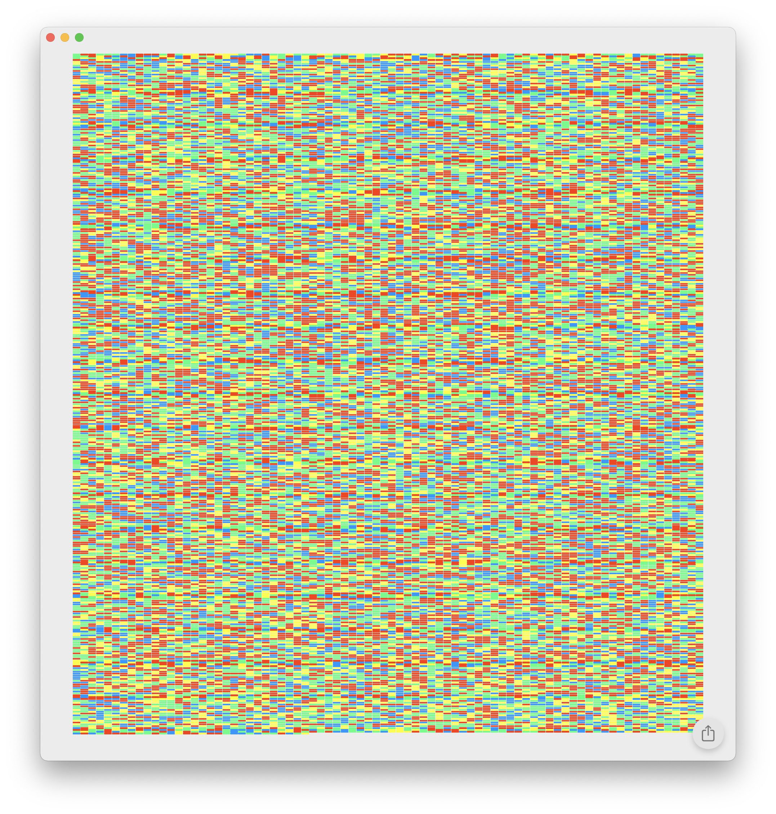

# Instancing



## About

An example showing how to use SwiftUI, Satin, Forge and Youi to draw instanced geometry based on the [SARS-COVID-19 Genome Sequence.](https://www.ncbi.nlm.nih.gov/nuccore/NC_045512) This example also shows how to export high resolution images using Satin.

## Building

Install Bundler using:

```
[sudo] gem install bundler
```

Config Bundler and Install

```
bundle config set path vendor/bundle
bundle install
```

Install the CocoaPod dependencies using Bundler:

```
bundle exec pod install
```

Finally, make sure to open the xcode WORKSPACE (and NOT the xcode project):

```
open Instancing.xcworkspace/
```
